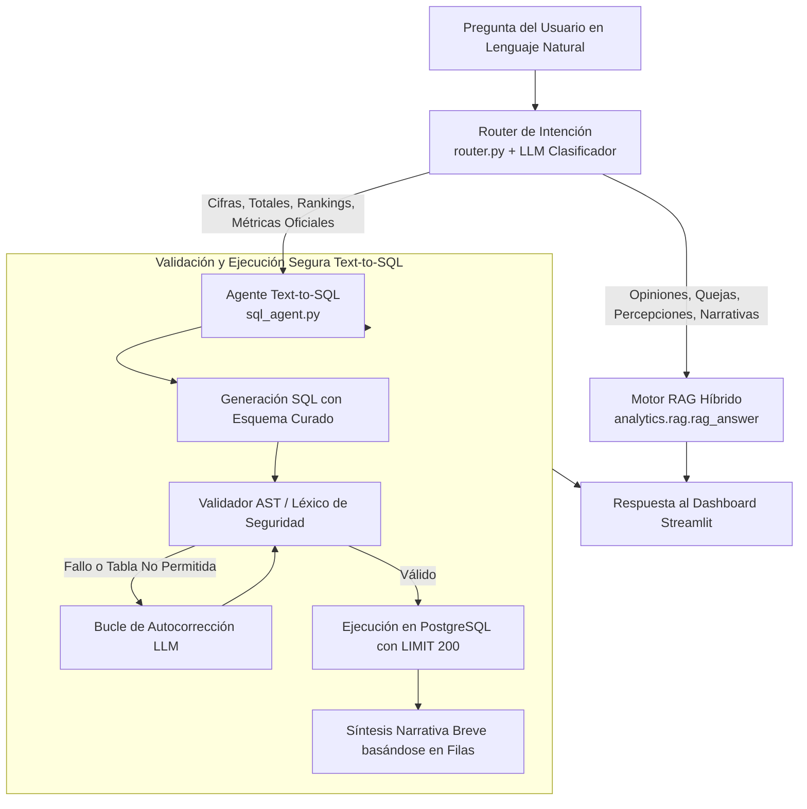

# Asistente Conversacional y Agente Text-to-SQL (`analytics/chat`)

Este módulo implementa el cerebro conversacional interactivo integrado en el AI-Dashboard de TUI. Proporciona una arquitectura de **doble motor (Router Inteligente)** que distingue entre consultas cuantitativas sobre datos oficiales y consultas cualitativas sobre la experiencia del viajero, garantizando respuestas exactas, seguras y libres de alucinaciones.

---

## 1. Arquitectura de Doble Motor



---

## 2. Componentes Principales

### 2.1. Router de Intención (`router.py`)
En lugar de depender de reglas heurísticas por palabras clave —frecuentemente engañadas por giros conversacionales como *"¿dónde podría yo encontrar más hoteles en el sur?"*—, el enrutamiento se delega al LLM con un prompt especializado (`temperature=0.0`):
* **Ruta `SQL`:** Preguntas que exigen agregaciones numéricas, series temporales, cálculos comparativos o rankings sobre tablas oficiales (empleo, plazas, paro, tráfico de aeropuertos, índices biofísicos o puntuaciones agregadas de sentimiento).
* **Ruta `RAG`:** Preguntas que demandan el contenido cualitativo de las opiniones ("por qué", testimonios, sensaciones, motivos de quejas vecinales).
* **Resolución de Ambigüedades:** Preguntas de comparación geográfica (*"¿qué diferencias hay entre Adeje y Arona?"*) se resuelven hacia `SQL` por defecto, activando `RAG` únicamente si se solicitan explícitamente opiniones de viajeros.
* **Calibración de Tokens:** Configurado con `max_tokens=150` para permitir que el modelo `openai/gpt-oss-120b` complete su presupuesto interno de razonamiento sin truncar la decisión.

### 2.2. Agente Text-to-SQL de Solo Lectura (`sql_agent.py`)
Desarrollado de forma nativa sin *frameworks* pesados (sin LangChain) para mantener el control determinista sobre cada paso de ejecución.

#### Catálogo Curado de Tablas Gold
Para evitar alucinaciones en los nombres de columnas y evitar JOINs desordenados, el agente opera sobre un esquema cerrado de tablas maestras:
1. `gold.gold_municipio_master`: Métrica consolidada actual por municipio (31 filas: plazas regladas `n_plazas_registro`, hoteles, viviendas vacacionales, empleo, paro, densidad).
2. `gold.gold_municipio_anual` y `gold.gold_municipio_mensual`: Series temporales evolutivas (2018–2025) de empleo, paro y vivienda vacacional.
3. `gold.gold_municipio_empleo`: Desglose trimestral de afiliados a la Seguridad Social (asalariados vs. autónomos).
4. `gold.gold_turismo_hotelero_anual` y `_mensual`: Encuesta hotelera ISTAC (viajeros, pernoctaciones, estancia media y ocupación).
5. `gold.gold_aena_pasajeros`: Tráfico mensual de pasajeros y operaciones en Tenerife Sur (TFS) y Tenerife Norte (TFN).
6. `gold.gold_h3_master`: 2.579 hexágonos espaciales con atributos topográficos, biofísicos y restricciones legales (`pct_area_enp`, `pct_area_zona_turistica`).
7. `gold.gold_h3_sentimiento`: 410 hexágonos con cobertura georreferenciada de sentimiento y `queja_principal`.

#### Protocolo de Seguridad en Capas
1. **Sentencia Única:** Rechazo tajante de sentencias múltiples (prohibición de `;`).
2. **Operación Exclusiva `SELECT`:** Validación mediante expresiones regulares contra el inicio de la cadena.
3. **Lista Negra de Palabras Clave:** Bloqueo terminante de `INSERT`, `UPDATE`, `DELETE`, `DROP`, `ALTER`, `TRUNCATE`, `GRANT`, `CREATE`.
4. **Lista Blanca de Tablas:** Solo se permite referenciar tablas pertenecientes a `ESQUEMA_GOLD`.
5. **Inyección de Límites:** Aplicación forzosa de `LIMIT 200` si la consulta no define un tope menor.
6. **Protección de Granularidad:** El prompt instruye explícitamente el uso de subconsultas (`WHERE cod_municipio IN (...)`) en lugar de `JOIN` entre niveles dispares (e.g. hexágonos H3 frente a municipios), previniendo el sesgo por duplicación de filas en cálculos de medias o sumas.

#### Bucle de Autocorrección y Síntesis
Si una consulta falla en la validación estática o arroja un error en PostgreSQL, el agente captura el mensaje de excepción y ejecuta un reintento inyectando el motivo del fallo en el prompt. Una vez obtenidos los datos, el modelo sintetiza una respuesta ejecutiva en 1-2 frases utilizando nombres municipales legibles en lugar de códigos INE.

---

## 3. Ejemplo de Uso y Verificación

```python
from analytics.chat.router import clasificar
from analytics.chat.sql_agent import responder_sql
from app.data import get_db_engine

engine = get_db_engine()

# 1. Enrutamiento automático
pregunta = "¿Cuántas plazas hoteleras tiene registradas Adeje frente a Arona?"
destino = clasificar(pregunta)  # Retorna: "sql"

# 2. Ejecución y respuesta
if destino == "sql":
    respuesta = responder_sql(pregunta, engine)
    print("SQL Generada:", respuesta.sql)
    print("Respuesta:", respuesta.texto)
```
