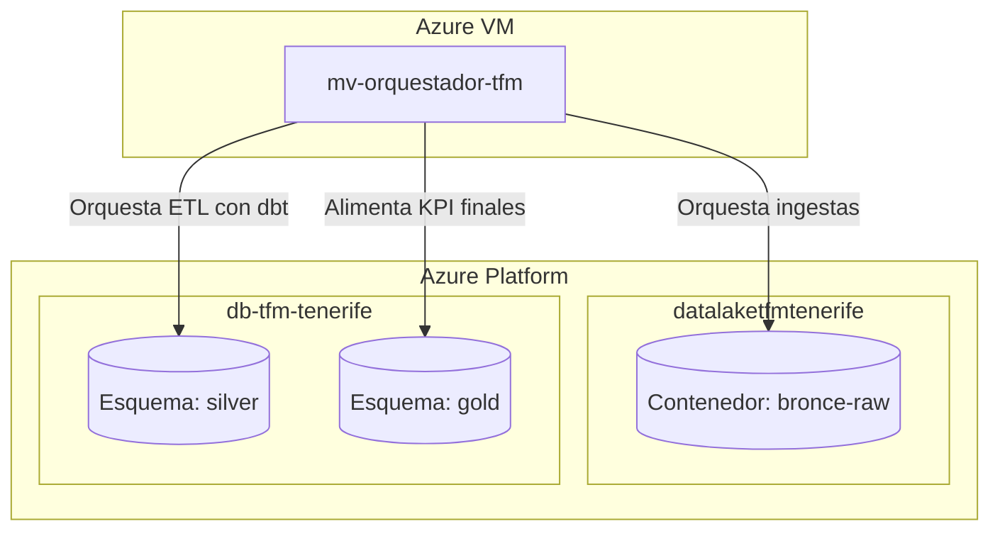

# Arquitectura de Infraestructura en Azure

Este documento describe la configuración de todos los recursos aprovisionados en **Microsoft Azure** (dentro del grupo de recursos `rg-tfm-tenerife`, región `Spain Central`) para el soporte de datos y orquestación del Tenerife AI-Dashboard.

---

## Mapa de Componentes y Capas

La arquitectura sigue los principios del **Data Lakehouse**, combinando almacenamiento en ficheros de bajo coste (Capa Bronce) con un motor relacional e indexación espacial (Capas Plata y Oro) y un orquestador automatizado.

---

## 1. Almacenamiento: Capa Bronce (Raw Data)
* **Nombre de la Cuenta**: `datalaketfmtenerife`
* **Tipo de Cuenta**: StorageV2 (Uso General v2)
* **Rendimiento**: Estándar
* **Replicación**: Almacenamiento con redundancia local (LRS)
* **Contenedor**: `bronce-raw`
* **Rol en el TFM**:
  - Almacena copias exactas en crudo de los microdatos de todas las fuentes en formato **Parquet (Snappy)**.
  - Almacenar el histórico masivo de clima en archivos Parquet (en lugar de base de datos) permite ahorrar espacio en base de datos y optimizar consultas.

---

## 2. Base de Datos: Capas Plata (Silver) y Oro (Gold)
* **Servidor**: Azure Database for PostgreSQL (Servidor Flexible)
* **Nombre del Servidor**: `db-tfm-tenerife` (Punto de conexión: `db-tfm-tenerife.postgres.database.azure.com`)
* **Configuración**: Con capacidad de ráfaga (Burstable B1ms), 1 núcleo virtual, 2 GiB de RAM, 32 GiB de almacenamiento.
* **Versión de PostgreSQL**: 16.14
* **Inicio de Sesión Administrador**: `patron_tfm`
* **Extensiones Habilitadas**: `postgis` (necesaria para operaciones y cálculos geoespaciales).
* **Rol en el TFM**:
  - **Esquema `silver`**: Contiene las tablas de origen limpias y estandarizadas (red de transporte, límites de municipios, zonas turísticas). Las tablas espaciales tienen índices **GIST** de geometría activos.
  - **Esquema `gold`**: Diseñado para las tablas y vistas agregadas que alimentarán el front-end y el simulador de decisiones (Cálculo del Índice TFM y KPIs).

---

## 3. Cómputo y Orquestación: Apache Airflow & dbt
* **Nombre de la VM**: `mv-orquestador-tfm`
* **Tamaño**: Standard B2ats_v2 (2 vCPUs, 2 GiB RAM - ~$0.0122/h)
* **Sistema Operativo**: Ubuntu Server 24.04 LTS
* **Inicio de Sesión Administrador**: `patron_tfm_mv` (Acceso vía SSH por puerto 22)
* **Recursos de Red asociados en Azure**:
  - **Interfaz de red**: `mv-orquestador-tfm232` (Conecta la VM a la red).
  - **Grupo de seguridad de red (NSG)**: `mv-orquestador-tfm-nsg` (Firewall de la VM, permite acceso SSH en puerto 22).
  - **Dirección IP pública**: `mv-orquestador-tfm-ip` (IP para acceso remoto de los integrantes y servicios).
  - **Red virtual**: `vnet-spaincentral-1` (Red interna segura en Spain Central).
* **Rol en el TFM**:
  - Servirá como el servidor central en producción donde se instalará **Apache Airflow** y se configurará la ejecución programada de los pipelines de dbt e ingestas automatizadas sin intervención humana.